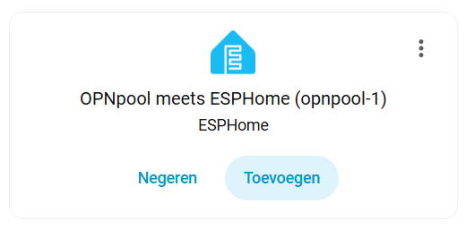
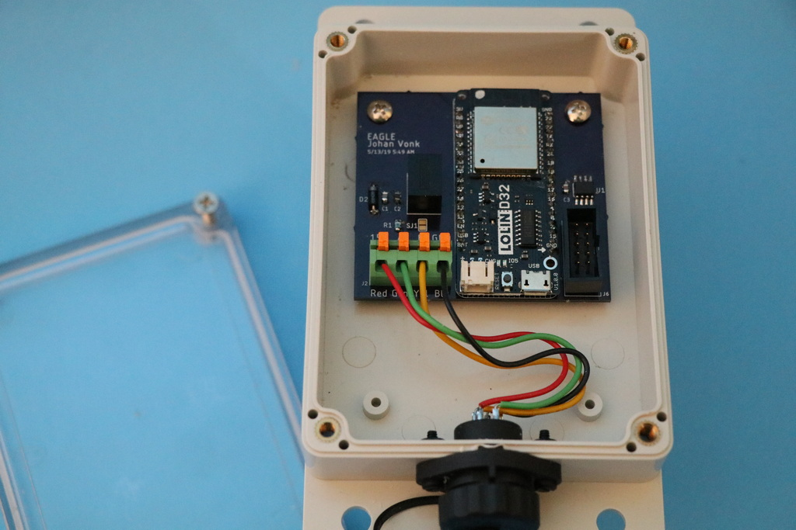
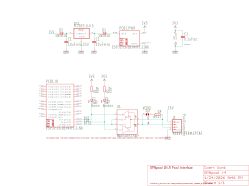
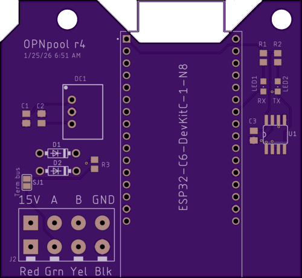

[](https://community.home-assistant.io/t/opnpool-meets-esphome-pentair-suntouch-controller-into-home-assistant/981965)

[](https://www.gnu.org/licenses/gpl-3.0)

> This is a port of my [original OPNpool](https://github.com/cvonk/OPNpool) to the ESPHome platform.

Ever dreamed of making your pool smarter and easier to manage? If you’ve ever owned a backyard pool, you know it’s not just about swimming—there’s a whole world of chemicals, covers, vacuums, brushes, and fiddling with thermostats and circuits. Even with a saltwater pool, you’ve got to keep a close eye on things!

Enter OPNpool: your pool’s new best friend. It takes all the classic pool controller features and brings them into your smart home. OPNpool keeps track of your controller, pump, and chlorinator, so you don’t have to run outside every time you want to check or change something. Even better, you can set up automations—like running the pump longer when it’s hot out—all from the comfort of your phone or smart home dashboard.

Thanks to some clever folks who reverse engineered the RS485 protocol, OPNpool can eavesdrop on the chatter between your pool’s components. The ESP32 inside shares all that state info as JSON/HTTP and can publish it via MQTT. And if you’re a Home Assistant fan, you’ll love how easily it integrates using MQTT Discovery.

# OPNpool meets ESPHome

OPNpool meets ESPHome is an open-source hardware and software solution that brings advanced pool automation to your smart home. By bridging legacy pool controllers with modern IoT platforms, OPNpool enables real-time monitoring, remote control, and seamless integration with Home Assistant. Whether you want to automate your pool pump based on temperature, monitor chlorinator status, or simply enjoy the convenience of remote access, OPNpool provides a robust and extensible platform for pool management.

## How it works

At its core, OPNpool connects an ESP32 microcontroller to your pool controller’s RS-485 bus. The ESP32 runs ESPHome firmware, which translates pool equipment data into Home Assistant entities. This allows you to view and control your pool’s thermostats, pumps, circuits, and chlorinator directly from your smart home dashboard or mobile app. The system is designed for reliability, safety, and ease of installation, with support for over-the-air updates and waterproof enclosures for outdoor use.

## Features

- [x] **Smart Home Integration:** Native support for Home Assistant and ESPHome.
- [x] **Remote Monitoring & Control:** Access your pool’s status and controls from anywhere.
- [x] **Community Driven:** Built on the work of pool automation enthusiasts and reverse engineers.
- [x] **Open Source:** Fully transparent hardware and software—customize and extend as needed.

## Getting started

No prior experience with pool automation or ESPHome is required. The documentation below will guide you through hardware assembly, wiring, firmware installation, and Home Assistant integration. If you have questions or need help, join the project’s GitHub Discussions for community support.

This device was tested with the Pentair SunTouch controller with firmware **2.080** (2013-07-15), connected to an IntelliFlo pump and IntelliChlor saltwater chlorinator.

> This open source and hardware project is intended to comply with the October 2016 exemption to the Digital Millennium Copyright Act allowing "good-faith" testing," in a controlled environment designed to avoid any harm to individuals or to the public.

## Acknowledgements

> We proudly acknowledge the work of reverse engineering pioneers [Joshua Bloch](https://docs.google.com/document/d/1M0KMfXfvbszKeqzu6MUF_7yM6KDHk8cZ5nrH1_OUcAc/edit), [Michael Russe](http://cocoontech.com/forums/files/file/173-pab014sharezip/), and [George Saw](http://cocoontech.com/forums/topic/27864-download-pitzip/). (Drop me a line if I forgot you.)

## Usage

Start with [installing the ESPHome environment](https://esphome.io/guides/installing_esphome/) on a beefy computer. In my case, this cut the compilation time to a minute, compared to half an hour when running it as an add-on to Home Assistant.

In an empty directory, create a `opnpool-1.yaml` configuration file as shown below.
```yaml
substitutions:
  device_name: opnpool-1
  friendly_name: "OPNpool meets ESPHome"
  description: "External component, see https://github.com/cvonk/OPNpool_meets_ESPHome"

esphome:
  name: ${device_name}
  comment: ${description}
  friendly_name: ${friendly_name}

esp32:
  variant: esp32c6          # or esp32     for <= r3 boards
  board: esp32-c6-devkitc-1 # or lolin_d32 for <= r3 boards
  framework:
    type: esp-idf

wifi:
  domain: !secret domain_name # only needed if not on the same subnet
  min_auth_mode: WPA2
  reboot_timeout: 0s
  networks:
  - ssid: !secret wifi_ssid
    password: !secret wifi_password

api:

ota:
  - platform: esphome
    password: !secret ota_password

external_components:
  - source: github://cvonk/OPNpool_meets_ESPHome
    components: [ opnpool ]

logger:
  level: VERBOSE          # build includes ESP_LOGx up to VERBOSE
  initial_level: WARN     # only show up to WARN globally
  logs:
    poolstate_rx: VERBOSE # show decoded messages

opnpool:
  id: opnpool_1
  RS-485:
    tx_pin:  21  # or 26 for <= r3 boards 
    rx_pin:  22  # or 25 for <= r3 boards
    rts_pin: 23  # or 27 for <= r3 boards
```

Specify your own secrets in `secrets.yaml`

```yaml
wifi_ssid: "REDACTED"
wifi_password: "REDACTED"
domain_name: ".iot.example.com" # appended to base fname to create FQDN for OTA updates
ota_password: "REDACTED"
api_encryption_key: "REDACTED"
```

Compile and upload the code using

```bash
esphome run opnpool-1.yaml
```

The first time, you need to upload over USB Serial, but after that you can use over-the-air updates.

In the output, you should see something like:

```text
[16:26:54.983]I (423) boot: Loaded app from partition at offset 0x10000
[16:26:55.024]I (465) boot: Set actual ota_seq=1 in otadata[0]
[16:26:55.029]I (465) boot: Disabling RNG early entropy source...
[16:26:55.268][W][component:333]: api set Warning flag: unspecified
[16:26:55.273][W][component:342]: wifi set Warning flag: scanning for networks
[16:27:01.293][W][component:373]: wifi cleared Warning flag
[16:27:25.143][E][RS-485:108][pool_req_task]: tx_q full
[16:27:55.144][E][RS-485:108][pool_req_task]: tx_q full
```

In the above trace, the `tx_q full` indicates that it can't transmit to the pool controller.

If you haven't already, add the ESPHome integration to Home Assistant.

[](https://my.home-assistant.io/redirect/config_flow_start/?domain=esphome)

Under Integrations, you will find now notice that Home Assistant auto discovered your new device.

[](https://my.home-assistant.io/redirect/integrations/)

{: style="display: block; margin-left: auto; margin-right: auto; width:300px;}

Add it, and specify your API key.  Name the device and assign it an area. You should then see the enities although their values are `unknown`.  Time to populate those entities by connecting it to the pool controller ;-)

## Connect

At the core this project is an ESP32 module and a 3.3 Volt RS-485 adapter. You can
breadboard this using:

* Any ESP32 module that has an USB connector and three GPIO pins available.
* Any "Max485 Module TTL". To make it 3.3 Volt compliant, change the chip to a `MAX3485CSA+`. While you're at it, you may as well remove the 10 kΩ pullup resistors (typically labeled `R1` to `R4`).
* A piece of Cat5 ethernet cable to connect to the pool controller.

{: style="display: block; margin-left: auto; margin-right: auto; width:300px;}


If you prefer to make this a more permanent solution, I suggest rolling a printed circuit board and housing it in a IP68 waterproof case with IP68 connectors.  More about this later.

> :warning: **THIS PROJECT IS OFFERED AS IS. IF YOU USE IT YOU ASSUME ALL RISKS. NO WARRANTIES. At the very least, turn off the power while you work on your pool equipment. Be careful, THERE IS ALWAYS A RISK OF BREAKING YOUR POOL EQUIPMENT.**

Understanding the above warning .. the RS-485 header can be found on the back of the control board. There are probably already wires connected that go to the devices such as pump and chlorinator.

{: style="display: block; margin-left: auto; margin-right: auto; width:400px;}

To minimize electromagnetic interference, use a twisted pairs from e.g. CAT-5 cable to connect the `A`/`B` pair to the RS-485 adapter as shown in the table below.

| Controller       | RS-485 adapter | idle state |         
|:-----------------|:--------------:|:-----------|
| `-DATA` (green)  |  `A`           | negative   |
| `+DATA` (yellow) |  `B`           | positive   |

Connect the RS-485 adapter to the ESP32 module.  I also pulled `GPIO#27` down with a 10 k&ohm; resistor, to keep it from transmiting while the ESP32 is booting.

| RS-485 adapter | ESP32 module |
|:---------------|:-------------|
| RO             | `GPIO#25`    |
| DI             | `GPIO#26`    |
| DE and RE      | `GPIO#27`    |
| GND            | `GND`        |

The serial monitor will start to show decoded messages such as:

```json
{CTRL_VERSION_REQ: {}}
{CTRL_VERSION_RESP: {"firmware":"2.80"}}
{CTRL_TIME_REQ: {}}
{CTRL_TIME_RESP: {"tod":{"time":"18:51","date":"2026-01-18"}}}
{CTRL_HEAT_REQ: {}}
{CTRL_HEAT_RESP: {"thermos":{"POOL":{"temp":54,"sp":63,"src":"NONE"},"SPA":{"temp":54,"sp"}
```

> :bulb: If you don't see such messages, make sure you didn't swap the data leads, or oddly enough some people report that they do need to swap the data leads.  To debug the datalink framing, set the `datalink_rx` logger level to `VERBOSE` and build and upload the code again. See futher below.

In Home Assistant the entities should populate, and show on your favorite Lovelace UI.

{: style="display: block; margin-left: auto; margin-right: auto; width:500px}


## PCB

For a robust and weatherproof installation, we recommend building a custom printed circuit board (PCB) to house the ESP32-C6 module, RS-485 adapter, and DC/DC converter. This approach ensures reliable connections, easier mounting, and long-term durability—especially for outdoor or poolside environments.

{: style="display: block; margin-left: auto; margin-right: auto; width:500px}

Note that the photo above is from a rev 1 board.


### Schematic

The hardware design features a buck converter that supplies 5V to the `5V0` pin on the ESP32-C6 DevKitC-1-N8 daughterboard. The scotty diode prevent issues when the board is also powered via USB.



The main data path runs between the RS-485 connector and the ESP32-C6 on the DevKitC-1-N8. An optional termination resistor is included to minimize signal reflections on the RS-485 bus.

### Board Layout

The entire schematic fits comfortably on a compact two-layer PCB. The board was designed using the free version of AutoDesk EAGLE, and all source files — including layout and schematics — are available in the [hardware directory](tree/main/hardware) of this repository.

{: style="display: block; margin-left: auto; margin-right: auto;}

### Bill of materials

| Name        | Description                                              | Suggested mfr/part#        | Price paid
|-------------|----------------------------------------------------------|----------------------------|-----------
| PBC r4      | Printed circuit board                                    | OSHPark                    | [$9.43](https://oshpark.com/)
| Enclosure   | 158x90x60mm ABS Plastic Junction Box, IP65               | *white label*              | [$9.81](https://www.harfington.com/products/p-1159792)
| RS-485_CONN | 5P Plug+socket, 5-pin, 16mm aviation, IP68               | SP16 5P                    | [$3.98](https://www.aliexpress.us/item/2251832722757291.html)
| RS-485-TERM | Fixed terminal block, 4-pin, screwless, 5 mm pitch       | Phoenix-Contact 1862437    | [$2.02](https://www.digikey.com/en/products/detail/phoenix-contact/1862437/6605421)
| ESP32-C6 DevKitC-1-N8 | ESP32-C6 dev board with 8MB flash, based on ESP32-C6-WROOM | ESP32-C6 DevKitC-1-N8      | [$9.00](https://www.digikey.com/en/products/detail/espressif-systems/ESP32-C6-DEVKITC-1-N8/17728861)
| MAX3485     | Maxim MAX3485CSA, RS-485/UART interface IC 3.3V, 8-SOIC  | Analog-Devices MAX3485CSA+T | [$5.64](https://www.digikey.com/en/products/detail/analog-devices-inc-maxim-integrated/MAX3485CSA-T/1703654)
| DC1         | DC/DC Converter R-78E5.0-0.5, 7-28V to 5V, 0.5A, 3-SIP   | RECOM-Power R-78E5.0-0.5   | [$3.30](https://www.digikey.com/en/products/detail/recom-power/R-78E5-0-0-5/2834904?s=N4IgTCBcDaIEoFEDCB5AsgWgAoHsDuApgE4AEcGA7ABwICsAdAAwaP20gC6AvkA)
| D1, D2      | Schottky Diode, 1N5818, 30V, 1A, DO-41                   | Diodes Incorporated 1N5818-T | [$0.30](https://www.digikey.com/en/products/detail/diodes-incorporated/1N5818-T/22054)
| LED1        | LED, Green Clear 571nm, 1206                             | Lite-On LTST-C150KGKT       | [$0.15](https://www.digikey.com/en/products/detail/diodes-incorporated/1N5818-T/22054)
| LED2        | LED, Amber Clear 602nm, 1206                             | Lite-On LTST-C150AKT       | [$0.15](http2s://www.digikey.com/en/products/detail/liteon/LTST-C150AKT/269213?s=N4IgTCBcDaIDIEsAuBTAtAeQHYAI4BUBlfNAYQEYBWABgEEBpfEAXQF8g)
| C1, C2      | Capacitor, 10 µF, 25 V, multi-layer ceramic, 0805        | KEMET C0805C106K3PACTU     | [$0.22](https://www.digikey.com/en/products/detail/kemet/C0805C106K3PACTU/5267604?s=N4IgTCBcDaINIFECyCAqACAwgBgBzYFZMBGbANjgGYAFAQU1QFUQBdAXyA)
| C3          | Capacitor, 0.1 µF, 6.3 V, multi-layer ceramic, 0805      | KEMET C0805C104M3RACTU     | [$0.12](https://www.digikey.com/en/products/detail/kemet/C0805C104M3RACTU/2211748?s=N4IgTCBcDaINIFECyCAqACAwgBgBzYFZMBGbAFiQGYAlAQU1QFUQBdAXyA)
| R1, R2      | Resistor, 68 Ω, 1/8 W, 0805                              | YAGEO RC0805FR-0768RL      | [$0.20](https://www.digikey.com/en/products/detail/yageo/RC0805FR-0768RL/728097?s=N4IgTCBcDaIJoEEDiBRA8gAgEoGEAMAHHgKwBiWAtHgOwBsBWAMiALoC%2BQA)
| R3          | Not stuffed, resistor, 120 Ω, 1/4 W, 0805                | KAO SG73S2ATTD121J         | [$0.00](https://www.digikey.com/en/products/detail/koa-speer-electronics-inc/RK73B2ATTD121J/10236600)
| PCB Screws  | Machine screw, #6-32 x x 3/16", panhead                  | Keystone-Electronics 9306  | [$0.10](https://www.digikey.com/en/products/detail/keystone-electronics/9306/2746085?s=N4IgjCBcpgTB0QGMoDMCGAbAzgUwDQgD2UA2iLAAwCsIAuoQA4AuUIAyswE4CWAdgHMQAX2GFYZEAGlcAT2zMifXAFoAoplxJuSnkmwACAJwBmSgDZ6woA)
| CONN Screws | Machine screw, M2-0.4 x 16 mm, cheese head               | Essentra 50M020040D016     | [$0.28](https://www.digikey.com/en/products/detail/essentra-components/50M020040D016/11639297)
| CONN Nuts   | Hex nut, M2-0.4, nylon                                   | Essentra 04M020040HN       | [$0.15](https://www.digikey.com/en/products/detail/essentra-components/04M020040HN/9677098)

Note that tariffs and shipping will add to the cost.

## Troubleshooting

Not all controller firmwares are created equally.  If you are not using firmware version 2.080, you will need dive down to the byte level and to tweak the network layer.  If you succeed, please send me an pull request, and I will iinclude it in the next release.

To show more (or less) debug information, specify the levels in `opnpoool-1.yaml`

```yaml
logger:
  level: VERBOSE       # build includes ESP_LOGx up to VERBOSE
  initial_level: WARN  # only show up to WARN globally
  logs:
    rs485: WARN
    datalink_rx: WARN
    datalink_tx: WARN
    network_rx: WARN
    network_create: WARN
    pool_task: WARN
    ipc: WARN
    poolstate: WARN
    poolstate_rx: VERBOSE
    opnpool: WARN
    opnpool_climate: WARN
    opnpool_switch: WARN
    opnpool_sensor: WARN
    opnpool_binary_sensor: WARN
    opnpool_text_sensor: WARN
    enum_helpers: WARN
```

For the `logger` component, it is recommended to use the following levels: `WARN`, which shows only warnings and errors; `INFO`, which includes informational messages such as configuration details, warnings, and errors; and `VERBOSE`, which provides very detailed logs, info, warnings, and errors. Be careful not to enable too much logging, as excessive output can negatively impact the connection between Home Assistant and the ESP32-C6.

### Decoding Stack Traces

If your ESP32-C6 crashes and you notice stack traces in the serial log, you can simplify debugging by enabling ESPHome's stack trace decoder. With this feature, exception addresses are automatically translated into human-readable function names and line numbers within your logs.

To activate the stack trace decoder, add the following lines to your YAML configuration:

```yaml
debug:
  update_interval: 5s  # for exception decoding in logs
```

> **Tip:** Detailed crash information will only appear on the serial console (not in the web logs). Be sure to check the serial output for troubleshooting.

# FAQ

**LEDs not blinking with RS-485 connected**

If communication fails, swap the `-DATA` and `+DATA` wires, as standards for these labels vary. 

**Is a controller required?**

This setup ensures that when selling the house, the next owner is not stuck with a "custom" system. They can use the pool conventionally or easily adopt the smart features.  If you're determined to build your own controller, I can recommend Russ Goldin's [nodejs-poolController](https://github.com/tagyoureit/nodejs-poolController/tree/master).

**Will it work with ___ board?**

There are many boards and kits that incorporate the ESP32. I started with the ESP8266, switched to the original ESP32, and use the ESP-C6. At this point it probably runs on any ESP32 flavor board. If you want to try something else, sure feel free the code is written to be portable. Just make sure you use the MAX3485 instead of the TTL-level MAX485.

**My firmware is ___ How do you update SunTouch firmware?**

Instead of taking such a risky step, I recommend enabling `VERBOSE` logging for `datalink_rx` and `network_rx`.  This will visualize the raw bytes received and messages interpretated. Compare that with the structures `network_msg.h`, and update the file as needed.

> Only do this if you very confident with flashing electronics. You risk bricking your pool controller.

Having read the above warning, you can upgrade if your controller is at [version 2.x](https://saturationregion.blogspot.com/2020/01/whats-deal-with-easytouch-versions-1.html). You will need to get a [USBDM JS16](https://www.aliexpress.us/w/wholesale-Freescale-USBDM-Programmer-JS16.html?spm=a2g0o.detail.search.0) programmer, [make](https://www.troublefreepool.com/threads/how-to-perform-firmware-upgrade-on-pentair-controllers.69589/#post-595657) a [JST cable](https://www.aliexpress.us/w/wholesale-5-PCS-JST-1.-25mm-Male-Female-6p.html?spm=a2g0o.detail.search.0) following [the instructions](https://www.troublefreepool.com/threads/how-to-perform-firmware-upgrade-on-pentair-controllers.69589/page-7#post-2021911).

#
I hope this project brings you joy.  Keep in touch through the dicussion forum.


